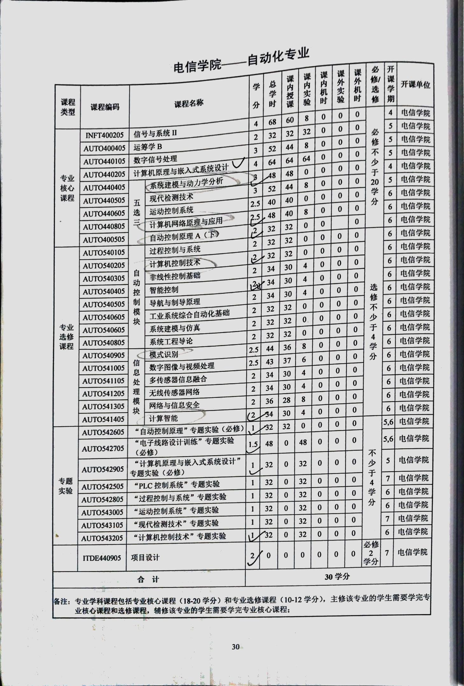

# 钱学森班/少年班（自动化）培养方案
> 本页面仅列出钱学森班/少年班（自动化）在各个学期特有的课程。若要查看本专业与整个钱学森班/少年班共享的课程，请参考对应的公选课页面（[钱班公选课](/program/qianxuesen)/[少年班公选课](/program/shaonianban-2015)）。

## 大二下（第4学期）
- 信号与系统：64学时

## 大二小学期
- 专业实习

## 大三上（第5学期）
- 运筹学B
- 数字信号处理
- 计算机原理与嵌入式系统设计

## 完整培养方案 Full

