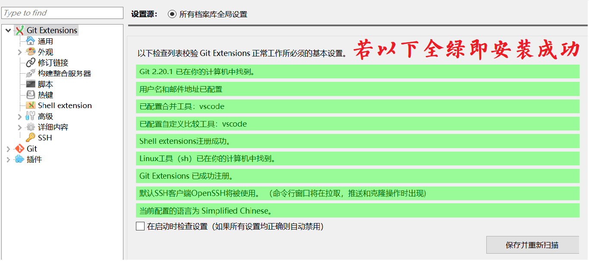

# 如何快速上手Git —— 关于Git客户端的一篇不太正经的介绍

## 简述

## Git Extensions

### 安装

点击[链接]()处，下载 Git Extensions

双击下载好的msi文件安装

出现这个界面时

- 若未安装过Git，可选择下面的Putty

- 若已经使用过Git，可以选择上面的OpenSSH

  > 这里是选择密钥加密方式。我们的GitHub远程仓库也需要钥匙才能打开。你注册的Github账号只能证明你具有管理仓库的身份，钥匙需要认证后生成，保存在本地。

一路右键，直到出现设置界面

如果缺少软件配置合并比较工具kdiff3，说明未安装此工具，有两个解决办法：

- 点击[这里]()安装合并比较工具

- 进入此界面左边的 `Git -> 设置` 中 ，选择本地已经安装的其它合并比较工具

## 

