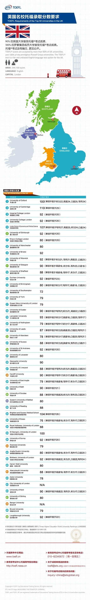
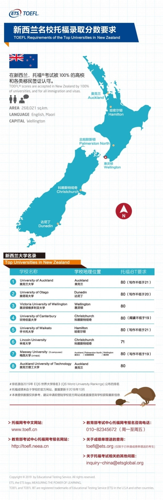
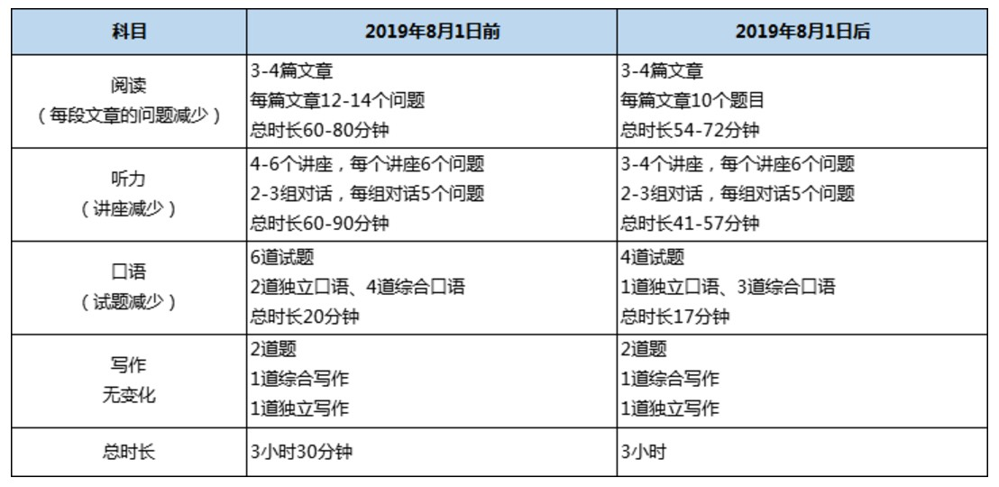
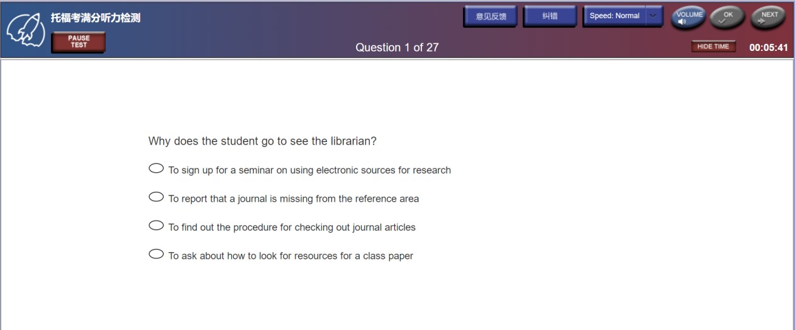
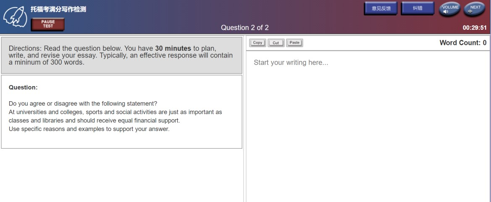

# 托福入门知识

## 各国名校录取分数要求

## TOEFL iBT 考试内容

　　TOEFL iBT（Internet-based Test）为网络形式考试，使用英语语言出题。考试内容包含四项(阅读、听力、口语和写作)，综合考查这四项技能。整场考试约需3小时。

　　在考试期间，您需要将多种英语沟通技能相结合，例如：
  
　　▶阅读、听录音，然后口头回答问题
  
　　▶听录音，然后口头回答问题
  
　　▶阅读、听录音，然后写出问题答案

　　此次托福新政改革从2019年8月1日起开始实施。以下为2019年托福改革前、后考试时长和考试题量的变化。

1. 阅读

　　阅读部分约为54到72分钟，包括3到4篇文章，每篇大约700个单词，每篇对应10道试题，增加了图表题、篇章总结题等。考生在考试过程中可使用复查功能。
  
　　考试界面右面是阅读材料,左边是题目,右上角有倒计时,你可以选择隐藏(不过通常这样比较冒险,容易答不完)。每次只出一道题目,每道题的答案所对应段落的前面会有一个→,做完每道题,点右上角的next进入下一题,当然也可以退回来检查,注意阅读的最后一题是将正确选项用鼠标拖到相应的位置,如果要修改也是如此拖动。如果全部答完觉得没有问题的话,点击右上角的continue进入下一个section,或听力考试。(注：实际考试没有左上角的四个钮，计时器在右上角，大体是Back钮下面)
  
　　阅读重要的是找语块，托福阅读首先应当确定语块的位置，然后大多数题目不必联系上下文也可以找出答案。语块既可能是一个句子，几个句子，也可能是一个段落。
背单词对阅读很重要，不仅是对句意的把握，托福的词汇题可能与上下文联系不紧密，所以必须要了解词意。

2. 听力

　　听力部分（不加试的前提下）共包括28道试题，包含两个对话(conversation)和三段课堂讲解(lecture)。听力部分的时间大约是41分钟。每个对话涉及2个或2个以上的说话者，时长2-3分钟，对应5道试题;每段演讲时长4-6分钟，对应6道试题。考生可以在听录音的过程中做笔记帮助答题。
  
　　听力考试的播放界面是一幅图外加时间条,这时千万不要多看那幅图，而应该抓紧时间记笔记。听力语段结束之后是答题界面,先出题目后出选项。大section的答题时间是10分钟,小的是六分半，一定要注意听力考试答题顺序是单向的,而且同一个section一起计时，这意味着答完后面的题是回不到前面的,所以要多多注意右上角的时间,合理安排。此外，听力答题在进入下一题的时候,不光要点next,还要再点一下ok才能进入下一题,都答完后,点击continue进行中场休息。
  
　　Conversation大多数人选择不记笔记，lecture记笔记的比较多。可以用单词的前三个字母简记，或者用简单的符号。主要在于听而非记，记笔记也可以是为了防止走神。

3. 口语

　　口语部分共有4道题，总时间约为17分钟。其中一道为独立回答题，还有一道总结两个交谈者的观点，另外两道要求考生先阅读一段文字然后再听一段与其内容相关的听力材料，最后考生按照要求回答相关问题。阅读材料是70-100单词的自然段，共45秒钟的阅读时间。听力材料可能是对话，也可能是演讲，其长度大约为1分半钟，150-180个单词。第3题和第4题以考试中的听力材料为基础，要求考生回答相关问题。考生可以在听录音的过程中做笔记来帮助答题。考查综合语言技能题目的评分以回答的质量、完整性和准确性为依据。
  
　　口语考试第一题的界面是题目要求,同时会有准备/陈述时间的倒计时，2-4题界面同样包括题目要求和倒计时,3、4题会有要求考生看的文字材料出现,30秒后消失 (注:口语考试的界面,随着题目的变化是自动跳转,不需要手动操作)。

4. 写作

　　托福iBT写作包括两道试题：综合写作试题与独立写作试题，要求考生在大约50分钟的时间内完成。
  
　　综合写作试题以阅读和听力材料为基础，考生首先需要阅读一篇学术演讲，然后需要听一段大约为2分钟的课堂讲解，考生在听录音的过程中可以做笔记来帮助答题。考生有20分钟的时间来总结听力材料中的要点，并解释这些要点与阅读材料中的要点有何不同。每个写作任务的分数是0-5分。考查综合语言技能作文题目的评分以回答的质量、完整性和准确性为依据。在综合写作界面,首先是左边出现限时3分钟的阅读材料,3分钟后材料会自动消失,听力材料播放开始;听力材料结束后,刚才隐去的阅读内容会在屏幕的左边重新出现,同时屏幕右侧会有让你输入的空格。综合写作限时20分钟,字数要求最少150字。(注:写作中大小写都是需要自己转换,段落自己划分。)
  
　　独立写作试题要求考生根据自己的知识和经验陈述、解释并支持对某一问题的某种看法，在综合写作之后进行。考生答完检查完综合写作试题后,可以点击右上角的continue进入独立写作部分，左侧是给出的论述题目，右侧的空格输入内容。独立写作限时30分钟，字数要求最少300字。如果提前答完并且检查无误后，可以交卷。
写作需要记模板以及一些高分表达，综合写作也需要记笔记，而且很重要。独立写作要求语言的多样性，准确性，生涩难懂的词汇有时候不一定是一个好的选择。

5. 加试

　　您所参加的考试可能会在 Reading or Listening section 设有额外的问题，这些问题将不计入您的成绩。这些问题或者是使 ETS 能够让考试成绩在考试施行的范围内具有可比性的问题，或者是有助于 ETS 确定这些问题如何在真实的考试环境下发挥作用的新问题。加试内容可分为只加一篇阅读；只加听力的一个conversation和一个lecture；或同时加一篇阅读和听力的一个conversation和一个lecture（俗称‘’双加”，欧皇专属）。

## 实施“MyBest Scores”(我的最佳成绩)，即“拼分”

　　考生的成绩单上不仅显示某场考试的单次成绩，还会自动显示“MyBest Scores”最佳成绩，且最佳成绩中每场考试的具体日期也会显示。

## 有效期
1. 托福成绩有效期多久?

　　ETS规定,新托福考试成绩的有效期是2年。托福成绩是考生委托ETS直接邮寄给大学的,而ETS保留托福成绩的时间是2年,而且是从考生参加考试的时候起算的，这一点一定要注意。比如，你是2018月8月26日参加的考试，那么你的成绩到2020年8月26日就过期了。过了这个期限，学生的成绩在ETS系统里面就查不到了,当然也就不能再寄送给学校。

　　有的同学可能还会有疑问，如果是2018年8月考的托福,要申请2020年秋季入学,那么开学前成绩就已过期了,是不是就不能申请了?事实并非如此,美国大学申请其实是会提前一年进行,申请2020年秋季入学的,实际申请时间是在2019年年底到2020年3月之间,在这段时间内,托福成绩仍然是有效的,只要是在学校规定的DEADLINE之前成绩仍在效期内就可以。

2. 成绩过期了怎么办?
  
　　成绩过期了其实没有什么解决办法的，成绩过期后ETS就不会帮你保存了，如果还想申请美国大学，那就需要重新考试，所以，一定要在有效期内申请大学。

## 
附：2019年考试时间安排

